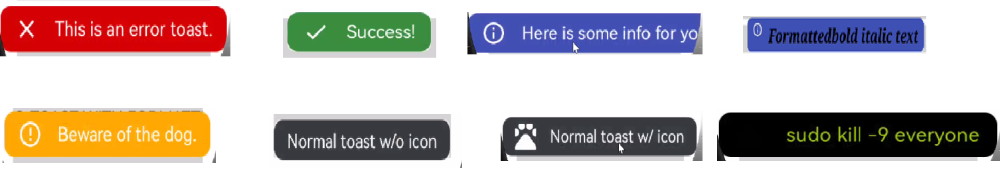

# Toasty

[](https://github.com/applibgroup/Toasty/actions/workflows/main.yml)

## Introduction

The usual Toast, but with steroids.
## Source

The code in this repository was inspired from https://github.com/GrenderG/Toasty. We are very thankful to GrenderG.

## Screenshot


&nbsp;&nbsp;&nbsp;&nbsp;&nbsp;&nbsp;&nbsp;&nbsp;&nbsp;&nbsp;&nbsp;&nbsp;&nbsp;&nbsp;&nbsp;&nbsp;

## Features

* Error Toast
* Success Toast
* Info Toast
* Warning Toast
* Normal Toast(Without Icon)
* Normal Toast(With Icon)
* Custom Configuration
* Follows Material Design guidelines

## Installation

In order to use the library, add the following line to your **root** gradle file:

1. For using Toasty module in sample app, include the source code and add the below dependencies in entry/build.gradle to generate hap/support.har.
```
    dependencies {
        implementation fileTree(dir: 'libs', include: ['*.jar', '*.har'])
        implementation project(path: ':toasty')
        testImplementation 'junit:junit:4.13.1'
        ohosTestImplementation 'com.huawei.ohos.testkit:runner:1.0.0.200'
    }
```

2. For using Toasty in separate application using har file, add the har file in the entry/libs folder and add the dependencies in entry/build.gradle file.
```
    dependencies {
        implementation fileTree(dir: 'libs', include: ['*.jar'])
        testImplementation 'junit:junit:4.13.1'
    }
```

3. For using Toasty from a remote repository in separate application, add the below dependencies in entry/build.gradle file.
```
    dependencies {
        implementation 'dev.applibgroup:toasty:1.0.1'
        testImplementation 'junit:junit:4.13.1'
    }
```
## Usage

To use Toasty in your app simply follow below simple steps:

#### Java
Each method always returns a Toast object, so you can customize the Toast much more. DON'T FORGET THE show() METHOD!

To display an error Toast:

```
Toasty.error(yourContext, "This is an error toast.", Toast.LENGTH_SHORT, true).show();

```
To display a success Toast:

```
Toasty.success(yourContext, "Success!", Toast.LENGTH_SHORT, true).show();
```

To display an info Toast:

```
Toasty.info(yourContext, "Here is some info for you.", Toast.LENGTH_SHORT, true).show();
```

To display a warning Toast:

```
Toasty.warning(yourContext, "Beware of the dog.", Toast.LENGTH_SHORT, true).show();
```

To display the usual Toast:

```
Toasty.normal(yourContext, "Normal toast w/o icon").show();
```

To display the usual Toast with icon:

```
Toasty.normal(yourContext, "Normal toast w/ icon", yourIconDrawable).show();
```

You can also create your custom Toasts with the custom() method:

```
Toasty.custom(yourContext, "I'm a custom Toast", yourIconDrawable, tintColor, duration, withIcon,
shouldTint).show();
```

## Support & extension

Currently image icon is transparent for Custom configuration.

